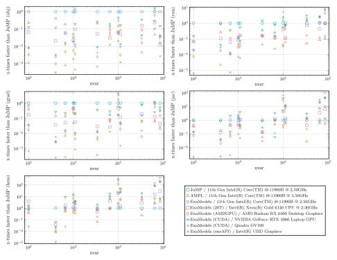

# Highlights

## Key differences from other algebraic modeling tools
ExaModels.jl is different from other algebraic modeling tools, such as [JuMP](https://github.com/jump-dev/JuMP.jl) or [AMPL](https://ampl.com/), in the following ways:
- **Modeling Interface**: ExaModels.jl requires users to specify the model equations always in the form of `Generator`s. This restrictive structure allows ExaModels.jl to preserve the SIMD-compatible structure in the model equations. This unique feature distinguishes ExaModels.jl from other algebraic modeling tools.
- **Performance**: ExaModels.jl compiles (via Julia's compiler) derivative evaluation codes tailored to each computation pattern. Through reverse-mode automatic differentiation using these tailored codes, ExaModels.jl achieves significantly faster derivative evaluation speeds, even when using CPU.
- **Portability**: ExaModels.jl goes beyond traditional boundaries of
algebraic modeling systems by **enabling derivative evaluation on GPU
accelerators**. Implementation of GPU kernels is accomplished using
the portable programming paradigm offered by
[KernelAbstractions.jl](https://github.com/JuliaGPU/KernelAbstractions.jl).
With ExaModels.jl, you can run your code on various devices, including
multi-threaded CPUs, NVIDIA GPUs, AMD GPUs, and Intel GPUs. Note that
Apple's Metal is currently not supported due to its lack of support
for double-precision arithmetic.

## Performance
ExaModels.jl significantly enhances the performance of
derivative evaluations for nonlinear optimization problems that can
benefit from SIMD abstraction. Recent benchmark results demonstrate
this notable improvement. Notably, when solving the AC OPF problem for
a 9241 bus system, derivative evaluation using ExaModels.jl on GPUs
can be up to two orders of magnitude faster compared to JuMP or
AMPL. Some benchmark results are available below. The following 
problems are used for benchmarking:
- [LuksanVlcek problem](../guide)
- [Quadrotor control problem](../quad)
- [Distillation column control problem](../dist)
- [AC optimal power flow problem](../opf)

