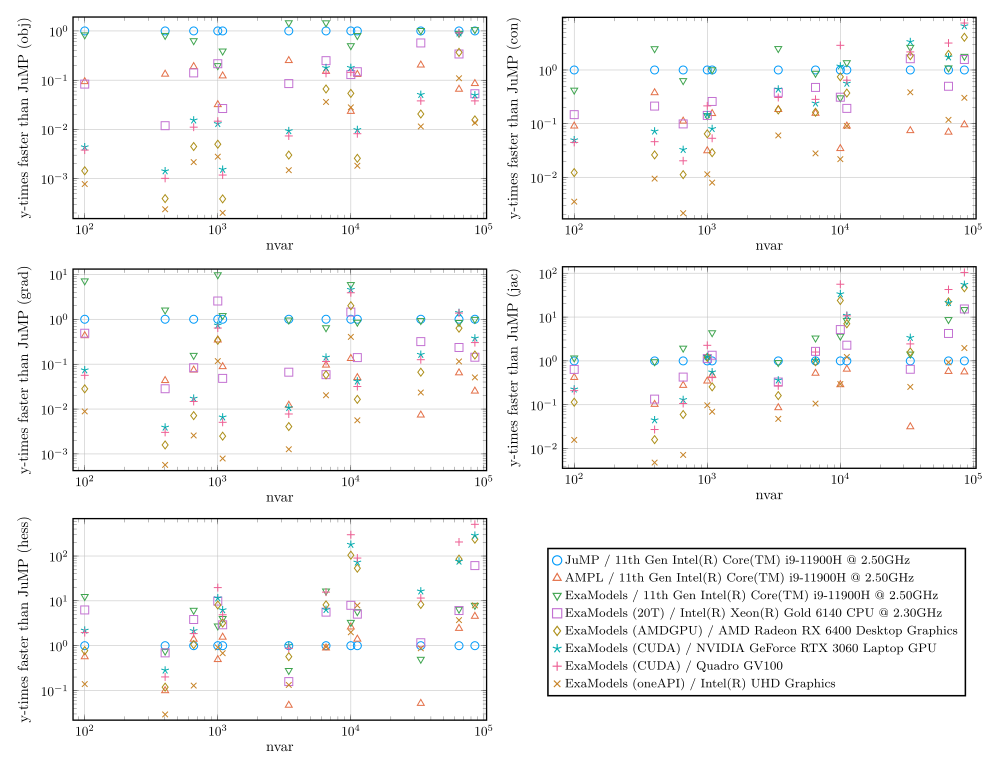

# Highlights

## Key differences from other algebraic modeling tools
ExaModels.jl is different from other algebraic modeling tools, such as [JuMP](https://github.com/jump-dev/JuMP.jl) or [AMPL](https://ampl.com/), in the following ways:
- **Modeling Interface**: ExaModels.jl enforces users to specify the model equations always in the form of `Generator`. This allows ExaModels.jl to preserve the SIMD-compatible structure in the model equations.
- **Performance**: ExaModels.jl compiles (via Julia's compiler) derivative evaluation codes that are specific to each computation pattern, based on reverse-mode automatic differentiation. This makes the speed of derivative evaluation (even on the CPU) significantly faster than other existing tools.
- **Portability**: ExaModels.jl can evaluate derivatives on GPU accelerators. The code is currently only tested for NVIDIA GPUs, but GPU code is implemented mostly based on the portable programming paradigm, [KernelAbstractions.jl](https://github.com/JuliaGPU/KernelAbstractions.jl). In the future, we are interested in supporting Intel, AMD, and Apple GPUs.

## Performance
For the nonlinear optimization problems that are suitable for SIMD abstraction, ExaModels.jl greatly accelerate the performance of derivative evaluations. The following is a recent benchmark result. Remarkably, for the AC OPF problem for a 9241 bus system, derivative evalution using ExaModels.jl on GPUs can be up to 2 orders of magnitudes faster than JuMP or AMPL.

